<p align="center">
  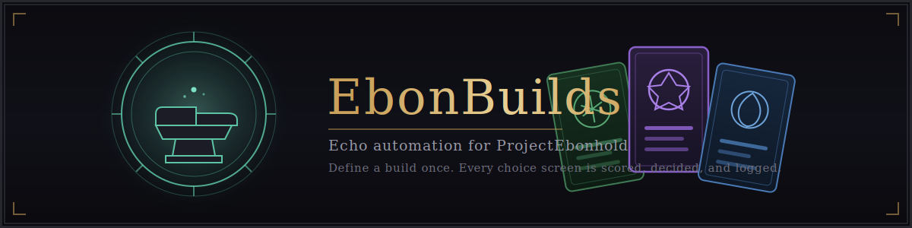
</p>

<p align="center">
  <a href="https://github.com/Lzra2000/-ProjectEbonHoldBuildAutomation/actions/workflows/lua-syntax.yml"></a>
  <a href="https://github.com/Lzra2000/-ProjectEbonHoldBuildAutomation/releases/latest"></a>
  
  
</p>

<p align="center">
  <b>English</b> | <a href="README.de.md">Deutsch</a> | <a href="README.ru.md">Русский</a> | <a href="README.pt-BR.md">Português (Brasil)</a> | <a href="README.es.md">Español</a> | <a href="README.fr.md">Français</a> | <a href="README.pl.md">Polski</a>
</p>

A World of Warcraft (3.3.5a) addon for **ProjectEbonhold** that automates echo picks (Banish / Reroll / Freeze / Select) based on a build you define, and tunes itself over time from real gameplay data.

Requires **ProjectEbonhold** or **ProjectEbonhold Enhanced**. Some features additionally use **[Details!](https://www.curseforge.com/wow/addons/details)** damage meter if installed.

<p align="center">
  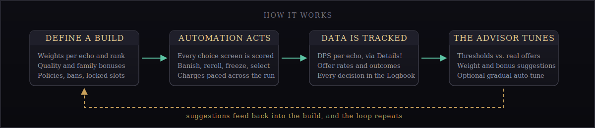
</p>

## What it does

- **Define a build**: per-echo weights, quality/family/novelty bonuses, locked slots, banned echoes.
- **Automation**: evaluates every echo choice screen against your build and acts (banish/reroll/freeze/select) so you don't have to.
- **Tuning Advisor**: compares your Banish/Reroll/Freeze thresholds against what your build actually gets offered (not a theoretical model), suggests better values, and can auto-tune them gradually over time.
- **Whole-run budget pacing**: thresholds automatically get stricter as Banish/Reroll/Freeze charges run low, so you don't burn your last charges on borderline offers.
- **DPS & appearance-rate tracking**: with Details! installed, tracks real DPS per active echo; always tracks how often each echo actually appears on a choice screen. Both can optionally sync with other players of the same class.
- **Manual Training Mode**: suspend automation for a build, pick manually, and EbonBuilds learns from your choices, generating weight suggestions from what you actually preferred.
- **Weight & bonus suggestions**: DPS data and manual picks both feed into per-echo weight suggestions, and (experimentally) Quality/Family bonus suggestions.
- **Stats workspace**: Summary, Echoes, Actions, and Recommendations views with same-build run comparison, evidence confidence, and Apply/Undo/Dismiss workflows for recommendations.
- **Logbook**: a decision-first audit trail of every automation action — time, action, decision, explanation, charges — with search, filters, and a detail inspector.
- **Per-quality weights**: echo weights can differ per quality rank (Common through Epic), including negative values and per-echo protection.
- **EchoWishlist export**: generates `EWL1` import strings compatible with the EchoWishlist addon.
- **Export (AI)**: a full plain-text dump of your build's settings, every echo available to your class with real effect descriptions, and all tuning data — meant to be pasted into an AI chat for analysis.
- **Tome Atlas**: community-sourced drop locations for echo tomes.
- **Public Builds**: browse and import builds shared by other players.

See [`FAQ.md`](FAQ.md) for detailed explanations of every feature and the full version history.

## Screenshots

The tour below follows the addon's actual workflow: configure a build, let Autopilot run it, then read what the run produced.

### 1 · Configure the build

Rank values, policies, and the exact score automation will use, per Echo:

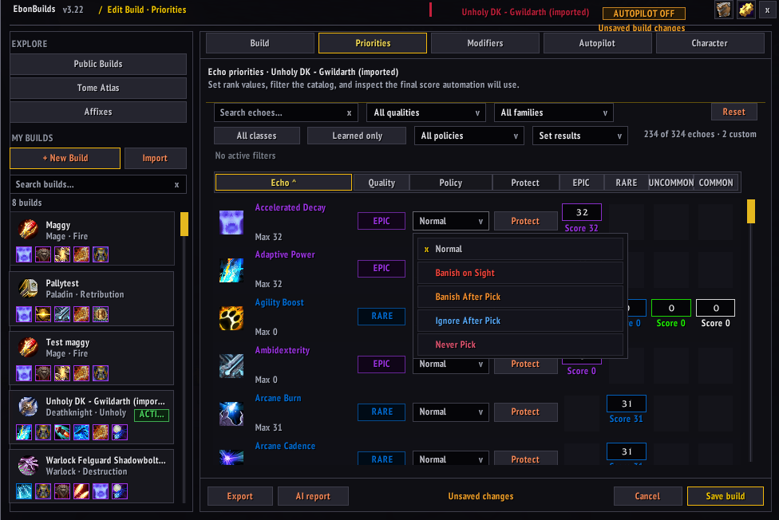

Broad strokes on top of that -- rank strategy, role emphasis, and the unique-Echo bonus:

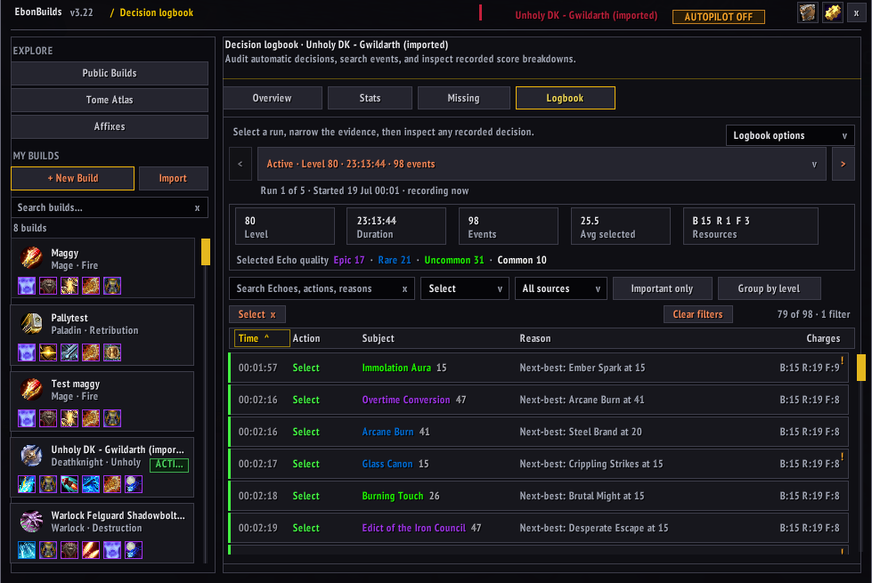

Then pick an intent and tune the three decisions Autopilot makes for you:

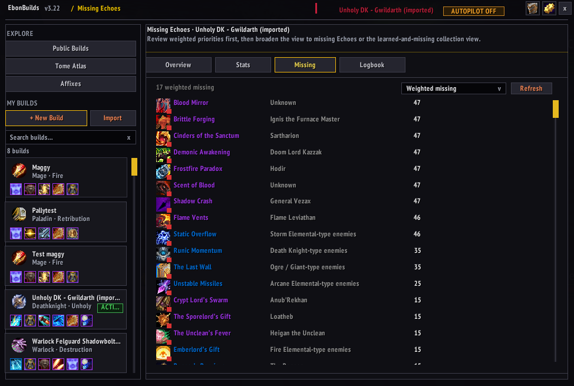

### 2 · The Character tab

The build stores a snapshot of a character -- talents, glyphs, and equipped gear -- and models everything against the build's own spec:

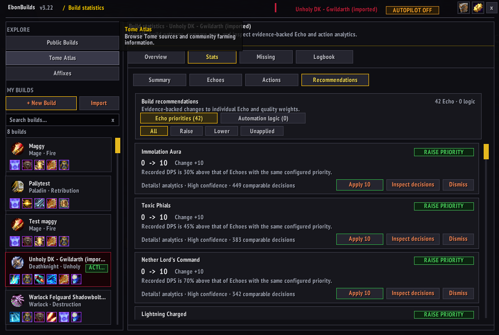

The complete talent trees, every talent of every tree, with the snapshot's allocation:

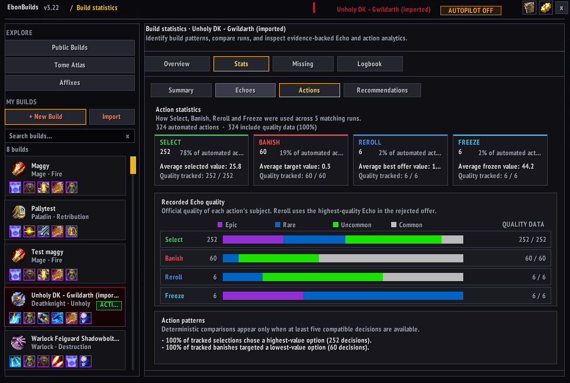

And the gear view: equipped items, affixes per slot, modeled scores:

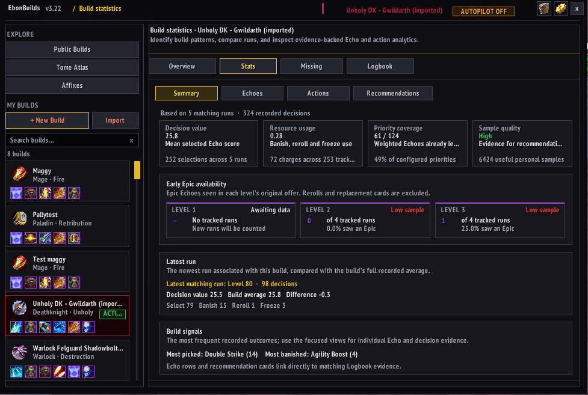

### 3 · Run it

The build overview is home base -- locked Echoes, sharing, autopilot and training toggles, exports:

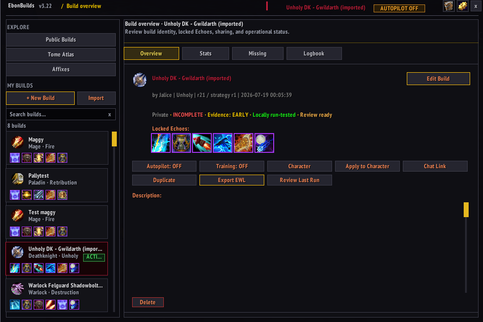

While Autopilot plays, every decision is recorded with its reasoning and the next-best alternative:

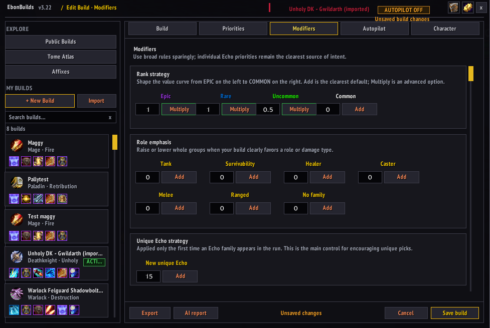

### 4 · Learn from the data

The statistics views aggregate recorded runs -- decision value, resource usage, sample quality:

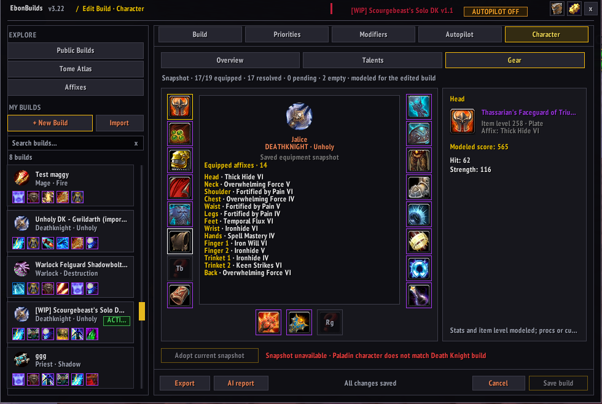

How the four actions were actually used, with recorded Echo quality per action:

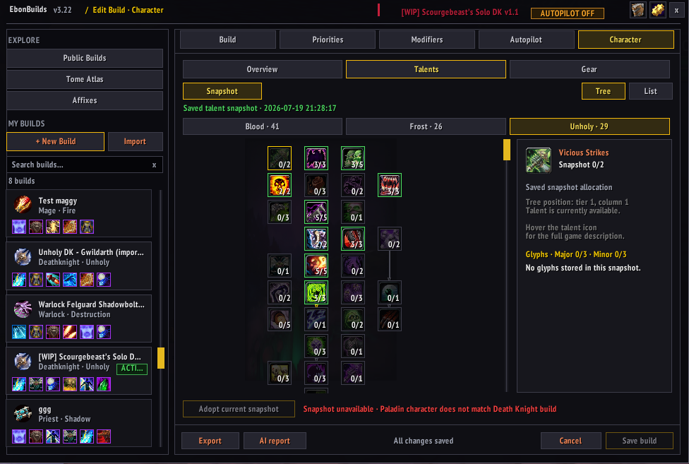

And evidence-backed recommendations, each with its confidence and a link to the exact decisions behind it:

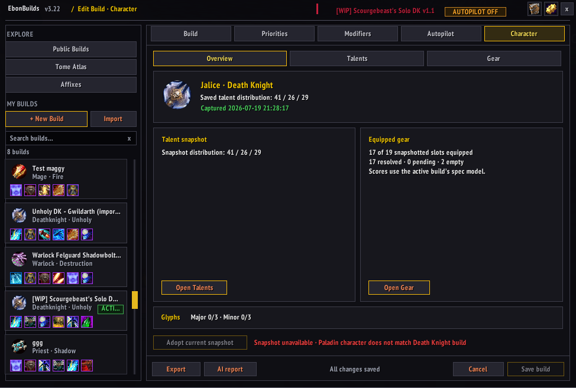

Finally, the Missing view shows which weighted Echoes you haven't learned yet, and where they drop:

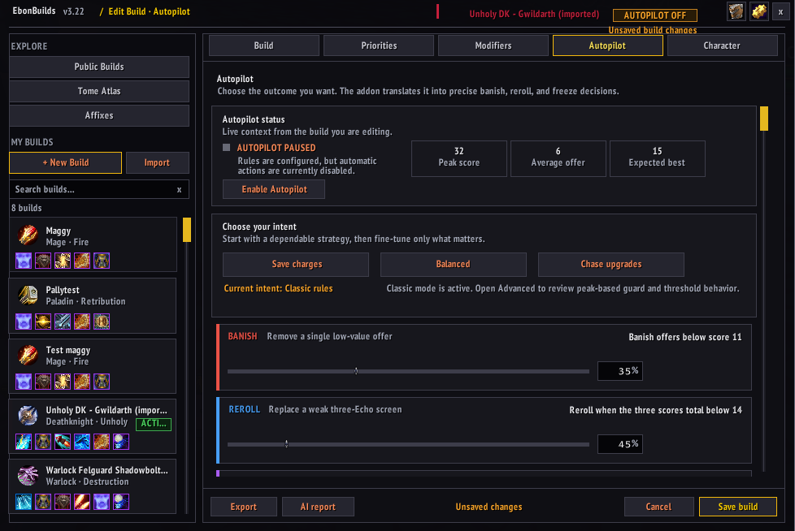

## Installation

This repository's root *is* the addon folder (`EbonBuilds.toc`, `core/`, `modules/` sit at the top level, not nested inside a subfolder).

**Via Git:**
```
cd "World of Warcraft/Interface/AddOns"
git clone <this-repo-url> EbonBuilds
```

**Via ZIP download:** GitHub's "Download ZIP" names the extracted folder after the branch (e.g. `EbonBuilds-main`) — rename it to exactly `EbonBuilds` before placing it in `Interface/AddOns/`, so the folder name matches `EbonBuilds.toc`.

Then restart the game or `/reload`.

## Commands

Just `/ebb` (or `/ebonbuilds`) -- opens or closes the main window. Everything that used to be a separate slash command now lives in the gear icon (Settings) in the window's header, so it's all in one place instead of needing to remember a subcommand: language, auto-sell, bag affix dots, debug logging, Click Trace, the Debug/Error/Click Trace logs, Tuning Advisor, Tome Atlas, Affixes reference, the commands guide, and the active build's EWL export and Manual Training reset.

## Localization

The build editor's tabs, buttons, and tooltips are translated into German, Spanish, French, Polish, Brazilian Portuguese, and Russian, matching the languages this README is already available in. EbonBuilds picks a translation automatically from your client's own language, or you can override it with `/ebb locale <code>`.

Translation strings live in `modules/i18n/locales/*.lua`, one file per language, each mapping the original English string to its translation. Adding a language: run `sh scripts/new-locale.sh <code>` to generate a starting file pre-filled with every known key, then translate the values -- see `CONTRIBUTING.md` for the rest of the steps. Game-specific terms (Echo, Build, Banish/Reroll/Freeze/Select, Autopilot) are kept in English across all languages, matching the existing README translations -- follow that convention rather than translating them.

Only the build editor is translated so far; the rest of the addon's UI still falls back to English (missing keys never error, they just show the English text). Extending coverage to more views is just adding more `EbonBuilds.L["..."]` call sites and the matching translation-table entries.

## Documentation

The [wiki](https://github.com/Lzra2000/-ProjectEbonHoldBuildAutomation/wiki) covers getting started, every setting, localization, development, and troubleshooting. Its source lives in [`docs/wiki/`](docs/wiki/) and is versioned with the code. Security concerns -- hostile sync payloads, malicious import strings, data-sharing consent -- have their own reporting path: see [SECURITY.md](SECURITY.md).

## Reporting bugs

Attach the Error log or Debug log output (Settings -- gear icon in the main window -- Windows & tools) to your report -- it's the single fastest way to get something fixed instead of guessed at.

## Development

See `CONTRIBUTING.md` for setup, the pre-PR checklist, and project conventions. Quick version:

- Pure Lua, WotLK 3.3.5a API (Interface 30300).
- One-time setup: `sh scripts/dev-setup.sh` installs the toolchain (`lua5.1`, `texlive-binaries` for the test suite, `zip`). Debian/Ubuntu (`apt`) only — on Windows, use WSL.
- `sh scripts/check.sh` runs the full local check suite (syntax check, test suite, `.toc` file verification, 3.3.5a API check, file-header check) — the same checks as `.github/workflows/lua-syntax.yml`, in one command.
- `sh scripts/install-hooks.sh` wires up a pre-commit hook that runs `scripts/check.sh` automatically (skip once with `git commit --no-verify`).
- `sh scripts/build-dist.sh` packages `EbonBuilds.toc`, `core/`, `modules/`, and `media/` into `dist/EbonBuilds.zip`, ready to drop into `Interface/AddOns/` (the in-game FAQ ships as generated Lua; `FAQ.md` itself stays repo-only).
- `sh scripts/release.sh <version>` is the release helper: refuses to run unless `FAQ.md` has changed since the last tag, bumps the version in `EbonBuilds.toc` and `FAQ.md`, runs the check suite, then commits and tags (does not push).
- Pushing the tag triggers `.github/workflows/release.yml`, which re-runs the checks, builds the zip, and publishes the GitHub Release with `EbonBuilds.zip` attached as a release asset. `GITHUB_TOKEN=... sh scripts/publish-github-release.sh <version>` remains as a manual fallback when Actions is unavailable.
- For day-to-day development the repo root itself already *is* the addon folder structure expected by `Interface/AddOns/` — the dist zip is only needed for a clean shareable release build.

## License

See [`LICENSE`](LICENSE). Personal and private-server community use is free; redistributing modified versions under the EbonBuilds name, or commercial use, requires prior permission from the copyright holder.
