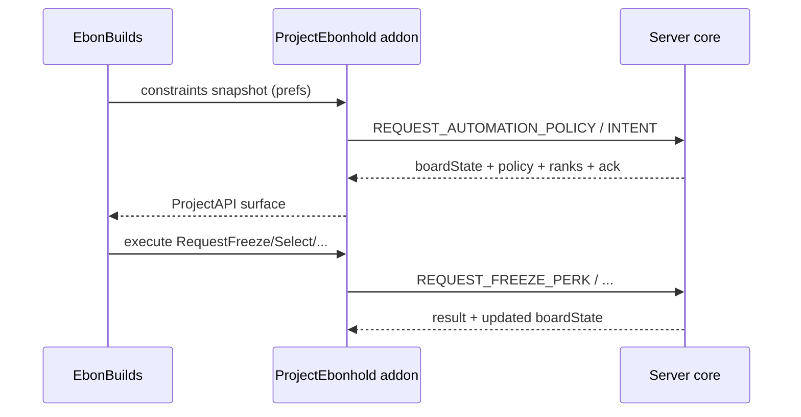

# Automation server redesign

**Status:** design (no implementation yet)  
**Audience:** EbonBuilds + ProjectEbonhold server maintainers  
**Umbrella:** [#49](https://github.com/Lzra2000/ProjectEbonHoldBuildAutomation/issues/49)  
**Work packages:** [#50](https://github.com/Lzra2000/ProjectEbonHoldBuildAutomation/issues/50) (WP1) · [#51](https://github.com/Lzra2000/ProjectEbonHoldBuildAutomation/issues/51) (WP2) · [#52](https://github.com/Lzra2000/ProjectEbonHoldBuildAutomation/issues/52) (WP3) · [#53](https://github.com/Lzra2000/ProjectEbonHoldBuildAutomation/issues/53) (WP4) · [#54](https://github.com/Lzra2000/ProjectEbonHoldBuildAutomation/issues/54) (WP5)  
**Related:** closed [#38](https://github.com/Lzra2000/ProjectEbonHoldBuildAutomation/issues/38), merged [#41](https://github.com/Lzra2000/ProjectEbonHoldBuildAutomation/pull/41) / [#42](https://github.com/Lzra2000/ProjectEbonHoldBuildAutomation/pull/42), enhancement [#46](https://github.com/Lzra2000/ProjectEbonHoldBuildAutomation/issues/46) (out of scope — DPS benchmarks stay client-side)

This document is the approved target architecture for moving Autopilot decision authority from `Automation.lua` / `BoardDecision.lua` onto the ProjectEbonhold **server**, with EbonBuilds as a constrained executor. Implementation is tracked by the umbrella issue and five child work packages above.

---

## 1. Current state (post-v3.83)

### What works today

After freeze-first ([#41](https://github.com/Lzra2000/ProjectEbonHoldBuildAutomation/pull/41)) and server-API alignment ([#42](https://github.com/Lzra2000/ProjectEbonHoldBuildAutomation/pull/42)):

| Layer | Role today |
|---|---|
| **Server (core)** | Authoritative run resources, draw generation, freeze/banish/select/reroll acceptance, choice wire (`spellId,quality,flag`) |
| **ProjectEbonhold addon** | `PerkService` request API + `Perks` pending flags; parses `SEND_PLAYER_PERK_CHOICE` / `SEND_FREEZE_PERK_RESULT` |
| **EbonBuilds `ProjectAPI`** | Thin adapter: `Request*`, `GetCurrentChoice`, `GetPendingAction` (reads `pendingSelectSpellId` / `pendingFreezeIndex` / …) |
| **EbonBuilds Autopilot** | Full decision authority: score → freeze-first decide → execute one action → poll/recover |

Wire facts that any redesign must preserve (from the installed ProjectEbonhold distribution):

- Choice body: optional `N|` pending-rolls prefix, then `spellId,quality[,flag];…` where flag `1` = frozen, `2` = carried, `3` = **guaranteed** (active build-slot inject; server refuses freeze/banish).
- Freeze confirm often sets **`justFrozen`** on the existing choice entry via `SEND_FREEZE_PERK_RESULT` **without** a full board resend.
- In-flight guards live on `ProjectEbonhold.Perks` (`pendingFreezeIndex`, etc.); a refused duplicate request can stall Autopilot.
- Transport is 3.3.5a-valid: `SendAddonMessage` prefix `AAM0x9`, whisper-to-self, `eventId\tbody`, 240-byte soft limit with chunking (same family as AffixServer’s learned-affix feed, but **different event IDs** — AffixServer is not the Echo board path).

### Remaining pain

[#38](https://github.com/Lzra2000/ProjectEbonHoldBuildAutomation/issues/38) (reroll-after-freeze) was mitigated client-side, but the root shape remains:

1. **Two decision brains** — client scoring/policy vs server acceptance can disagree; client must reverse-engineer confirmations (`justFrozen`, resource counters, fingerprints).
2. **Implicit board state** — freeze pending / confirmed / spent is reconstructed in `boardState` + recovery polls, not declared by the server.
3. **Client-local tie-breaks** — equal scores use slot index in `BoardDecision`; server does not publish ranks, so two clients (or a future server helper) can diverge.
4. **Event reaction** — Autopilot reacts to UI/hooks + timers; there is no explicit intent → ack → apply cycle owned by the server.
5. **Prefs as a parallel policy layer** — protect families, min score, max rerolls live entirely in Automation/EchoPolicy and can fight server rules.
6. **Regression cost** — Logbook / `message.txt`-style exports are human evidence, not a first-class dry-run input the server (or CI) can replay.

---

## 2. Target architecture

### Principle

> **Server = decision authority. Client = executor + UI + local scoring hints for display.**

The server returns a **policy verdict per board** (and optionally per slot). EbonBuilds does not invent select/freeze/banish/reroll when a policy channel is available; it only executes the acknowledged intent and surfaces reasons in the Logbook.



### Board state machine (server-owned)

Explicit states on the **current offer** (one run, one pending rolls queue entry):

| State | Meaning | Allowed client intents |
|---|---|---|
| `OPEN` | Fresh or post-banish/reroll board; no unconfirmed freeze | freeze, banish, select, reroll (per policy) |
| `FROZEN_PENDING` | Freeze requested; not yet confirmed | **wait only** — no reroll/banish/select/second freeze |
| `CONFIRMED` | ≥1 freeze confirmed on this board (`justFrozen` / flag 1) | freeze (if under max), select; **no reroll** |
| `SPENT` | Selection accepted or board invalidated | none until next `SEND_PLAYER_PERK_CHOICE` |

Transitions:

```
OPEN → FROZEN_PENDING  (ack freeze intent)
FROZEN_PENDING → CONFIRMED  (SEND_FREEZE_PERK_RESULT success / authoritative flag)
FROZEN_PENDING → OPEN  (freeze rejected; clear pending)
CONFIRMED → FROZEN_PENDING  (additional freeze under max)
CONFIRMED → SPENT  (select success)
OPEN → SPENT  (select without freeze)
OPEN → OPEN  (successful banish replacement or reroll → new board identity)
* → OPEN  (new SEND_PLAYER_PERK_CHOICE with new offer identity)
```

**Hard rule:** while `FROZEN_PENDING` or `CONFIRMED` exists for the current offer identity, **reroll is illegal** (server rejects; client must not request). This encodes the #38 invariant at the authority layer.

Guaranteed cards (`flag=3` / `isGuaranteed`): policy may be `skip-guaranteed` for freeze/banish targets; they remain selectable and must never block rerolls when the board is otherwise `OPEN`.

### Policy verbs (per board / per slot)

Server returns one primary board action plus optional slot annotations:

| Verb | Meaning |
|---|---|
| `select` | Execute select on `targetSlot` / `targetSpellId` |
| `freeze` | Execute freeze on target; enter `FROZEN_PENDING` |
| `banish` | Execute banish on target |
| `wait` | Do nothing; reason required (pending ack, unstable board, …) |
| `skip-guaranteed` | Annotation: do not freeze/banish this slot |
| `reroll` | Execute reroll (only from `OPEN` with no freeze lock) |

Every verdict includes a **stable reason code** (machine) + short reason string (Logbook).

### Deterministic tie-policy (server)

When scores/weights produce ties, the server orders candidates with a published rule (never client-only sort):

1. Prefer higher **server rank** if provided (`rank` ascending or descending — pick one and freeze it in the API).
2. Else lower **slot index** (1-based left-to-right, matching current client `IsBetter`).
3. Else lower **echo / spell ID**.
4. Else prefer a slot **already frozen** when choosing among equals for select-after-freeze scenarios (stability).

Optional: attach `rank` (and maybe `scoreHint`) on each choice so EbonBuilds display and offline tests never invent ordering.

### Intent queue

Replace “timer saw a new board → decide → fire” with:

1. Client forms **intent** `{intentId, offerId, action, target, constraintsHash}`.
2. Client sends **request** (new CS event or extended body).
3. Server **acks** (`accepted` | `rejected`, `boardState`, `policy`, `reason`).
4. On `accepted`, client **applies** via existing `PerkService.Request*` (or a single `REQUEST_AUTOMATION_APPLY` that server already validated).
5. **Only one in-flight intent** per player; further intents are rejected with `wait` until ack clears.

This aligns with today’s pending flags but makes the ack **server-visible** and Logbook-friendly.

### Client prefs as constraints (not a second brain)

Settings such as `protectFamilies`, per-echo EchoPolicy, `minScore` / freeze-reroll thresholds, `maxRerolls` (session or board) are serialized into a **constraints blob** sent with policy/intent requests. The server may:

- honor them when they do not violate hard rules (freeze lock, guaranteed card, resource exhaustion), or
- override with reason `constraint_ignored_*`.

EbonBuilds stops applying a full parallel decide path when `capabilities.serverPolicy == true`; it may still score locally for UI/Logbook explanation.

### Simulation / dry-run

A server (or shared pure) API accepts a recorded transcript — Logbook export / DebugLog / community `message.txt` style lines — and returns the sequence of policy verdicts **without** mutating run state. Used for:

- CI regression fixtures (port of today’s 70k-board + freeze-first tests),
- bisecting #38-class failures from player exports,
- validating tie-breaks and state-machine transitions.

---

## 3. API sketch (3.3.5a-safe)

All messages stay on existing AddonMsg transport (`AAM0x9`, whisper-to-self). New numeric CS/SS IDs are allocated in ProjectEbonhold `projectebonhold.lua` (exact numbers TBD with server maintainers; do not collide with Affix `310–314` / Echo loadout `340+`).

### Capability probe

- Client reads `ProjectAPI.GetCapabilities().serverPolicy` (new), gated on addonVersion / explicit SS feature flag.
- Old servers: capability false → today’s client decide path unchanged.

### Constraints blob (client → server)

Compact, versioned, semicolon-friendly (fit chunking):

```
v=1;minScore=19;maxRerolls=8;protectFamilies=shadow,fire;policy=spellId:banish,spellId:preserve;...
```

Hash (`constraintsHash`) accompanies intents so server can detect stale prefs mid-board.

### Policy response (server → client)

Logical fields (encoding can be tabular like today’s choice wire):

```
offerId=<id>
boardState=OPEN|FROZEN_PENDING|CONFIRMED|SPENT
action=select|freeze|banish|reroll|wait
targetSlot=<0-based index or -1>
targetSpellId=<id or 0>
reasonCode=<TOKEN>
reason=<short text>
ranks=spellId:rank,spellId:rank,...
slotFlags=...   -- echo existing frozen/carried/guaranteed + skip-guaranteed
intentAck=<intentId>|none
intentStatus=accepted|rejected|none
```

### Intent request (client → server)

```
intentId=<monotonic>
offerId=<id>
action=freeze|select|banish|reroll
targetSlot=<n>
constraintsHash=<hex>
```

### Dry-run (dev / GM / offline tool)

Out of band preferred (HTTP/admin or Eluna console) so live players never hit it by accident. Input: transcript + build weights + constraints. Output: JSON/lines of `{step, boardState, action, reasonCode}`.

If forced onto AddonMsg for in-game debug: require GM flag and hard size limits.

### Mapping to today’s PerkService

Phase 1 can keep execution on existing:

- `CS.REQUEST_FREEZE_PERK` (207) / `SS.SEND_FREEZE_PERK_RESULT` (104)
- `CS.REQUEST_BANISH_PERK` (203) / `SS.SEND_BANISH_REPLACEMENT_PERK` (103)
- `CS.REQUEST_REROLL` (27) / new choice via `SS.SEND_PLAYER_PERK_CHOICE` (16)
- `CS.REQUEST_PLAYER_PERK_SELECTION` (17) / `SS.SEND_PLAYER_PERK_SELECTION_RESULT` (1000)

Policy/intent are **additional** messages; they must not require replacing `onEventReceived` single-callback ownership (EbonBuilds continues to use `ProjectAPI` + hooks, never steal PE handlers).

---

## 4. Client changes (EbonBuilds)

| Module | Direction |
|---|---|
| `ProjectEbonholdAPI.lua` | Expose policy fetch, intent submit, boardState, ranks; extend `GetCapabilities` |
| `BoardDecision.lua` | Keep as **fallback decider** + pure helper for dry-run fixtures; when serverPolicy active, become a validator (“server said X, would client have said Y?”) behind debug flag |
| `Automation.lua` | Shrink to: observe board → ensure constraints synced → submit/follow intent → apply on ack → Logbook reason from server |
| EchoPolicy / settings UI | Serialize to constraints; document which prefs are soft vs hard |
| Tests | Add transcript replay tests; keep freeze-first suite as fallback oracle |
| AffixServer | **Unchanged** (learned affixes only) |

Native choice UI and ProjectEbonhold auto-accept loadout path remain; Autopilot yields when native pending flags are set (already true post-#42).

---

## 5. Migration / compatibility

| Client | Server | Behavior |
|---|---|---|
| Old EbonBuilds (≤3.83) | Old or new server | Today’s path; new SS fields ignored by PE if unused |
| New EbonBuilds | Old server | `serverPolicy=false` → full client decide (freeze-first) |
| New EbonBuilds | New server | Intent/policy path; fallback if policy timeout |
| Mixed PE addon vs core | Capability negotiation fails closed to client decide |

Versioning:

- Constraints `v=1`, policy schema `v=1`.
- Breaking changes bump schema; server rejects unknown major with `wait` + reason.

No hard dependency on [#46](https://github.com/Lzra2000/ProjectEbonHoldBuildAutomation/issues/46) (DPS benchmark); benchmarks stay informational and must not feed server policy unless a future constraints field is explicitly designed.

---

## 6. Test plan

1. **Unit (Lua CI):** parse/format policy + constraints; state-machine transition table; tie-break vectors (equal score → slot → spellId → frozen).
2. **Fallback oracle:** with `serverPolicy` mocked off, existing `tests/test_freeze_first.lua` / recovery / project_api suites stay green.
3. **Server sim:** dry-run API replays curated Logbook / `message.txt` exports from #38 and Discord freeze-reroll reports; expect zero rerolls in `FROZEN_PENDING`/`CONFIRMED`.
4. **Guaranteed card:** policy never targets flag-3 for freeze/banish; select allowed; reroll not blocked on `OPEN`.
5. **Intent exclusivity:** second intent while one in-flight → reject; pending PE flags still observed.
6. **Compat matrix:** old client against new server smoke (manual); new client against old server automated capability false.
7. **Payload limits:** constraints + ranks fit AddonMsg chunking; fuzz hostile bodies (extend sync-fuzz patterns where applicable).

---

## 7. Risks

| Risk | Mitigation |
|---|---|
| Server/core schedule slips | Capability flag; client fallback remains supported for at least one major EbonBuilds series |
| AddonMsg size / rate | Compact encoding; constraints delta or hash-only after first sync |
| Dual-brain drift during rollout | Debug “policy vs BoardDecision” compare mode; Logbook both reason codes |
| PE single-handler limitation | No `onEventReceived` steal; extend PE officially or parse via negotiated multi-listener if server ships it |
| Over-trusting client constraints | Server hard rules always win; document override reason codes |
| Dry-run leaking into prod | GM/dev gate; no run mutation |

---

## 8. Work packages (priority)

1. **Board state machine + freeze lock** — [#50](https://github.com/Lzra2000/ProjectEbonHoldBuildAutomation/issues/50) — server states + reject reroll while pending/confirmed; surface `boardState` to client.
2. **Shared tie-break / ranks** — [#51](https://github.com/Lzra2000/ProjectEbonHoldBuildAutomation/issues/51) — publish ordering + optional per-card `rank`.
3. **Intent queue + acks** — [#52](https://github.com/Lzra2000/ProjectEbonHoldBuildAutomation/issues/52) — one in-flight intent; ack before apply.
4. **Replay / dry-run** — [#53](https://github.com/Lzra2000/ProjectEbonHoldBuildAutomation/issues/53) — transcript → verdicts for CI and triage.
5. **Constraints API** — [#54](https://github.com/Lzra2000/ProjectEbonHoldBuildAutomation/issues/54) — prefs as server inputs; remove parallel decide when policy active.

Tracking issues live in this repo; server-core tasks should be mirrored on the ProjectEbonhold server tracker and linked from each child issue.

